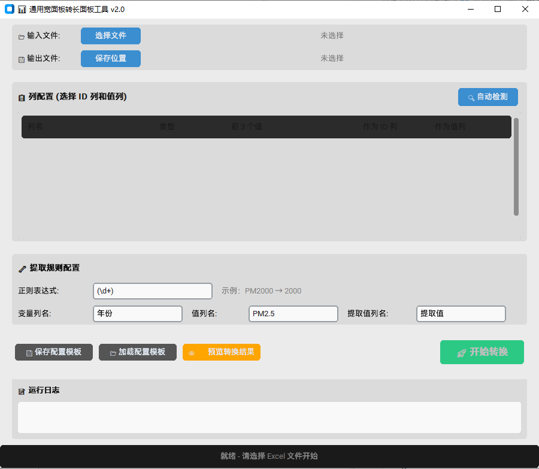

# 📊 通用宽面板转长面板工具 (Wide-to-Long Converter)

一个基于 Python 和 CustomTkinter 开发的**通用数据格式转换工具**，旨在帮助用户轻松将**宽面板数据 (Wide Format)** 转换为 **长面板数据 (Long Format)**。

无需编写代码，通过直观的图形界面 (GUI) 即可完成复杂的数据透视操作，支持自定义正则提取、列名配置和批量处理。


## ✨ 主要功能

- 🚀 **一键转换**: 将多列年份/时间数据（如 `PM2000`, `PM2001`...）快速堆叠为长格式。
- 🧠 **智能检测**: 自动识别常见的列名模式（如 `PM2000`, `2023Q1`, `Jan-Feb`），自动推荐 ID 列和值列。
- 🔧 **高度自定义**:
  - 手动勾选/取消 ID 列和值列。
  - **自定义正则表达式**提取变量值（支持任意复杂的列名格式）。
  - 自定义输出列名（如：年份、月份、季度、数值等）。
- 👁️ **实时预览**: 转换前可预览结果，确保配置正确。
- 💾 **配置模板**: 支持保存和加载 JSON 配置模板，方便复用处理同类数据。
- 🎨 **现代界面**: 基于 CustomTkinter 构建，支持深色模式，界面美观流畅。
- 📦 **单文件分发**: 可打包为独立的 `.exe` (Windows) 或二进制文件，无需安装 Python 环境即可运行。


## 📸 界面预览


> 界面包含：文件选择区、列配置区（自动检测/手动勾选）、正则规则配置、日志输出区。


## 🛠️ 技术栈

- **语言**: Python 3.8+
- **GUI 框架**: [CustomTkinter](https://github.com/TomSchimansky/CustomTkinter) (现代化的 Tkinter 封装)
- **数据处理**: [Pandas](https://pandas.pydata.org/) (强大的数据分析库)
- **Excel 支持**: [OpenPyXL](https://openpyxl.readthedocs.io/)
- **打包工具**: [PyInstaller](https://www.pyinstaller.org/)


## 🚀 快速开始

本应用为 Windows 平台打包的桌面程序，部署方式如下：
1. 访问 [GitHub项目页面](https://github.com/Pei-hsinWang/wide-long-converter)
2. 找到右侧的Release(发布)版本，下载安装包
3. 解压后双击运行可执行文件

无需联网或安装额外依赖，所有依赖均已打包在安装包中。


## 📖 使用教程

### 场景示例：PM2.5 数据转换

假设您有一个 Excel 文件 `data.xlsx`：

| 行政单元 | PM2000 | PM2001 | PM2002 |
| :--- | :--- | :--- | :--- |
| 北京市 | 50.5 | 48.2 | 45.1 |
| 上海市 | 42.3 | 40.1 | 38.5 |

**操作步骤：**

1.  **选择文件**: 点击“选择文件”加载 `data.xlsx`，选择输出路径。
2.  **自动检测**: 点击 **“🔍 自动检测”** 按钮。
    *   程序会自动识别 `PM2000`-`PM2002` 为值列，`行政单元` 为 ID 列。
    *   自动填充正则表达式 `(\d+)` 用于提取年份。
3.  **调整配置** (可选):
    *   修改输出列名：将 "变量" 改为 "年份"，将 "值" 改为 "PM2.5"。
4.  **预览**: 点击 **“👁️ 预览”** 查看转换后的前几行数据。
5.  **转换**: 点击 **“🚀 开始转换”**。

**输出结果 (`long_format.xlsx`):**

| 行政单元 | 年份 | PM2.5 |
| :--- | :--- | :--- |
| 北京市 | 2000 | 50.5 |
| 北京市 | 2001 | 48.2 |
| 北京市 | 2002 | 45.1 |
| 上海市 | 2000 | 42.3 |
| ... | ... | ... |

### 高级用法：自定义正则

如果您的列名格式特殊，例如 `Sales_2023_Q1`, `Sales_2023_Q2`：

1.  手动勾选 `地区` 作为 ID 列，勾选季度列作为值列。
2.  在 **正则表达式** 框中输入：`Q(\d)` (提取 Q 后面的数字) 或 `(\d{4}_Q\d)` (提取完整季度标识)。
3.  执行转换。


## 📂 项目结构

```text
wide-long-converter/
├── venv/                   # 虚拟环境目录 (忽略)
├── src/
│   └── main.py             # 主程序入口
├── dist/                   # 打包输出目录
├── build.py                # 一键打包脚本
├── requirements.txt        # 依赖列表
├── README.md               # 项目说明
└── .gitignore              # Git 忽略配置
```


## ⚙️ 开发说明

### 添加新功能

1.  在 `src/main.py` 中找到 `PM25ConverterApp` 类。
2.  在 `create_widgets` 中添加新的 UI 组件。
3.  在 `run_conversion` 中更新数据处理逻辑。


## 📄 许可证

本项目采用 MIT 许可证 - 查看 [LICENSE](LICENSE) 文件了解详情。


### 💡 提示

*   **首次运行较慢**: 第一次启动时可能需要加载大型库，属正常现象。
*   **大文件处理**: 处理超过 10 万行的数据时，请耐心等待，程序会在后台线程运行，不会卡死界面。
*   **正则测试**: 不确定的正则表达式可以先在 [regex101.com](https://regex101.com/) 进行测试。